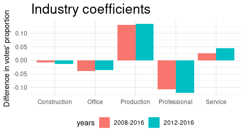

# pls-trump
Code and datasets used for the quantitative analysis of changes in Republican support between 2008 and 2016. The analysed factors were related to education levels, race, gender, religion and profession.

